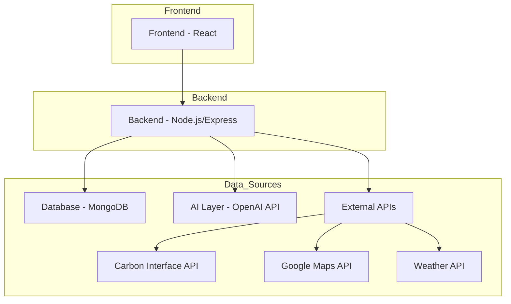
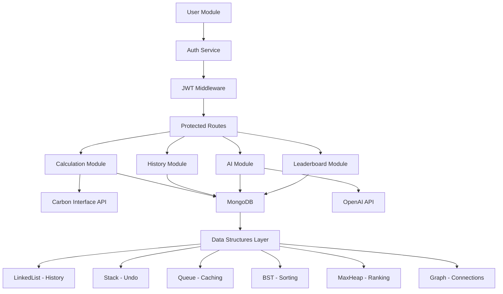
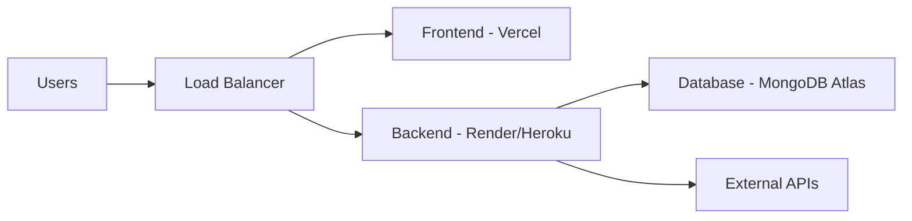

# CarbonSense System Architecture

## Overview



## Component Details

### 1. Frontend (React.js)
- User Interface
- State Management (Redux Toolkit)
- Routing (React Router)
- Styling (TailwindCSS)

### 2. Backend (Node.js + Express)
- RESTful API endpoints
- Authentication (JWT)
- Business Logic
- Data Processing

### 3. Database (MongoDB)
- User data storage
- Calculation history
- AI suggestions
- Leaderboard data

### 4. AI Layer (OpenAI API)
- Personalized recommendations
- Natural language processing
- Chat interface

### 5. External APIs
- Carbon Interface API: Emission factors
- Google Maps API: Distance calculations
- Weather API: Climate adjustments

## Data Flow

1. **User Authentication**
   ```
   Client → Auth API → Database → JWT Token → Client
   ```

2. **Carbon Calculation**
   ```
   Client → Calculation API → External APIs → Database → Client
   ```

3. **AI Recommendations**
   ```
   Client → AI API → OpenAI API → Database → Client
   ```

4. **Leaderboard Updates**
   ```
   Client → Leaderboard API → Database → Sorted Results → Client
   ```

## Module Interactions



## Security Layers

1. **Authentication**
   - JWT tokens
   - Password hashing (bcrypt)
   - Session management

2. **Authorization**
   - Role-based access control
   - Route protection
   - Data access restrictions

3. **Data Protection**
   - HTTPS encryption
   - Input validation
   - Sanitization

## Scalability Considerations

1. **Horizontal Scaling**
   - Load balancing
   - Database sharding
   - Microservices architecture

2. **Caching**
   - Redis for session storage
   - API response caching
   - Database query optimization

3. **Database Optimization**
   - Indexing
   - Aggregation pipelines
   - Connection pooling

## Deployment Architecture

